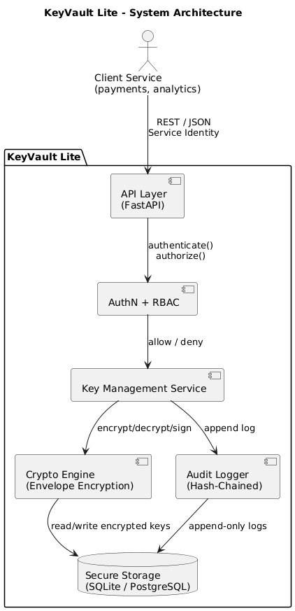
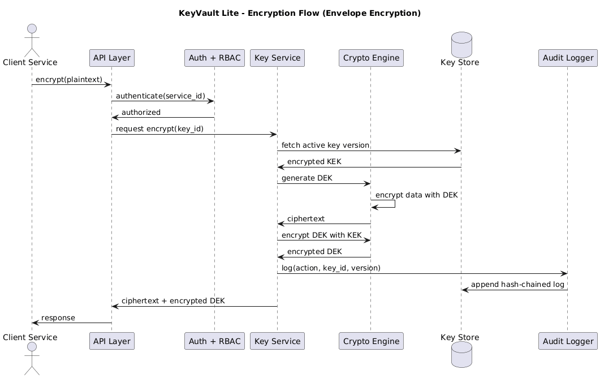

# 🔐 KeyVault Lite

<p align="center">
  
  
  
  <br />
  
  
  
</p>

> A lightweight, security-focused Key Management Service (KMS) inspired by real-world HSM and cloud KMS workflows.

> KeyVault Lite is conceptual API based on functionlity of a **real Hardware Security Module**. It demonstrate **security engineering principles, cryptographic key lifecycle management, access control, and auditability**.

---

## 🧠 What is KeyVault Lite?

**KeyVault Lite is a backend service that securely manages cryptographic keys and performs cryptographic operations on behalf of other services — without ever exposing raw keys.**

It is conceptually similar to:
- AWS KMS
- GCP Cloud KMS
- HashiCorp Vault (key-management subset)

---

## 🎯 Why This Project Exists

This project demonstrates:

- Secure key lifecycle management (create, rotate, revoke)
- Envelope encryption
- Per-service identity and role-based access control
- Tamper-evident audit logging
- Security-first backend design decisions

This is **not** about crypto APIs.  
It is about **designing systems that protect secrets by default**.

---

## 🧱 Core Design Principles

- Keys never leave the system
- All cryptographic operations are mediated
- Every sensitive action is authenticated, authorized, and audited
- Database storage is assumed compromised
- Audit logs must detect tampering
- Blast radius must be minimized

---

## 🏗️ System Architecture

### High-Level Architecture Diagram



**Key points:**
- Clients never talk directly to storage
- Cryptographic logic is isolated
- Audit logging is a first-class component
- Clear trust boundaries are enforced

---

## 🔁 Data & Code Flow

### Encryption Flow (Envelope Encryption)



**Flow summary:**
1. Client requests encryption
2. Service identity is authenticated and authorized
3. Active key version is fetched
4. A Data Encryption Key (DEK) is generated per request
5. Data is encrypted with the DEK
6. DEK is encrypted with a Key Encryption Key (KEK)
7. Operation is audit-logged
8. Ciphertext is returned to the client

---

## 🔑 Key Concepts

### Logical Keys & Key Versions

- Clients reference **logical keys**
- Each key has multiple **versions**
- Only one version is ACTIVE at a time
- Old versions can decrypt but never encrypt

This enables **safe, zero-downtime key rotation**.

---

### Envelope Encryption

KeyVault Lite never encrypts data directly with master keys.

```

MASTER KEY (environment variable)
↓ encrypts
KEY ENCRYPTION KEY (KEK)
↓ encrypts
DATA ENCRYPTION KEY (DEK)
↓ encrypts
USER DATA

````

Benefits:
- Safe key rotation
- Reduced blast radius
- Industry-standard KMS design

---

### Per-Service Identity

Clients are **services**, not users.

Each service:
- Has a stable identity
- Is assigned a role
- Has explicit permissions
- Is fully auditable

This mirrors real IAM-based systems.

---

### Audit Logging

Every sensitive operation is logged:
- Service identity
- Action
- Key ID and version
- Timestamp
- Result

Logs are:
- Append-only
- Hash-chained
- Tamper-evident

---

## 🗄️ Data Model

### Logical Keys

```sql
CREATE TABLE keys (
  id TEXT PRIMARY KEY,
  type TEXT NOT NULL,
  purpose TEXT NOT NULL,
  status TEXT NOT NULL,
  created_at TIMESTAMP NOT NULL
);
````

---

### Key Versions

```sql
CREATE TABLE key_versions (
  id TEXT PRIMARY KEY,
  key_id TEXT NOT NULL,
  version INTEGER NOT NULL,
  encrypted_key BLOB NOT NULL,
  status TEXT NOT NULL,
  created_at TIMESTAMP NOT NULL
);
```

---

### Services

```sql
CREATE TABLE services (
  id TEXT PRIMARY KEY,
  name TEXT NOT NULL,
  role TEXT NOT NULL,
  active BOOLEAN NOT NULL
);
```

---

### Audit Logs

```sql
CREATE TABLE audit_logs (
  id INTEGER PRIMARY KEY AUTOINCREMENT,
  service_id TEXT NOT NULL,
  action TEXT NOT NULL,
  key_id TEXT,
  key_version INTEGER,
  timestamp TIMESTAMP NOT NULL,
  result TEXT NOT NULL,
  prev_hash TEXT,
  hash TEXT NOT NULL
);
```

---

## 🔐 RBAC Model

| Role    | Permissions                                      |
| ------- | ------------------------------------------------ |
| ADMIN   | generate, rotate, revoke, encrypt, decrypt, sign |
| SERVICE | encrypt, decrypt, sign, verify                   |
| AUDITOR | read audit logs                                  |

Authorization is enforced **before every operation**.

---

## 🌐 API Overview

### Generate Key

**POST** `/keys`

```json
{
  "type": "AES",
  "size": 256,
  "purpose": "ENCRYPT"
}
```

---

### Encrypt Data

**POST** `/keys/{key_id}/encrypt`

```json
{
  "plaintext": "hello world"
}
```

Response:

```json
{
  "ciphertext": "BASE64...",
  "encrypted_dek": "BASE64...",
  "key_version": 3
}
```

---

### Rotate Key

**POST** `/keys/{key_id}/rotate`

* Creates a new key version
* Deprecates the old version
* Preserves ability to decrypt old data

---

### Audit Logs

**GET** `/audit`
Accessible only to `ADMIN` and `AUDITOR`.

---

## 🔍 Security Documentation

This project includes explicit security documentation:

* 📄 **Threat Model:** [`threat_model.md`](threat_model.md)
* 🛡️ **Security Policy:** [`SECURITY.md`](SECURITY.md)

These documents clearly define:

* Security assumptions
* Threats and mitigations
* Out-of-scope risks
* Responsible disclosure process

---

## 🚀 Running Locally

```bash
export KEYVAULT_MASTER_KEY=<base64-encoded-32-bytes>
uvicorn main:app --reload
```

---

## 🧪 Testing & Demo

* Use curl or Postman
* Simulate services via headers
* Rotate keys and decrypt old data
* Verify audit log integrity

---

## 🧠 Why This Project Matters

KeyVault Lite models how real KMS systems think internally:

* Keys are more sensitive than data
* Access must be explicit
* Rotation must be safe
* Auditability is non-negotiable

It demonstrates **system-level security engineering**, not just API development.

---

## 📜 License

MIT License
This project is open-source and intended for educational and portfolio use only.

---

## ⚠️ Final Reminder

**Do not use this system to manage real secrets.**
KeyVault Lite is an educational project, not a production security solution.

